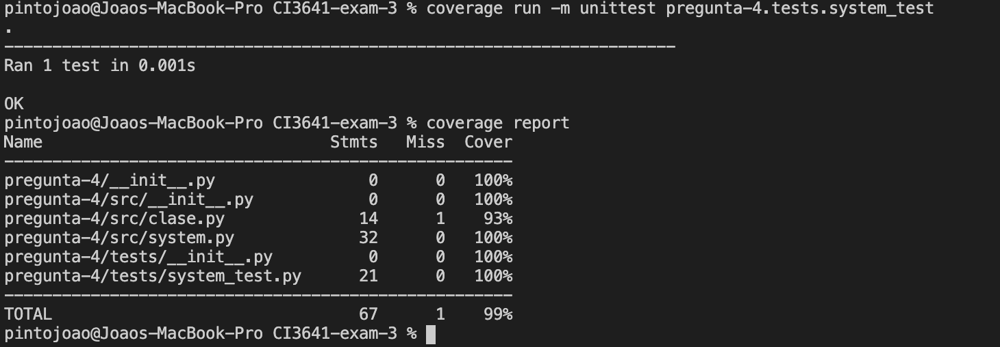

# Overview

En este modulo tenemos la respuestas de la pregunta de 4 del examen.

## Resultados de tests y coverage

Estos fueron los resultados de los tests y del coverage obtenidos:



# Ejecucion

Asegurese de usar una version de python superior o igual a la version `3.8`.

Desde la carpeta `pregunta-4` ejecuta:

```
python3 -m src.main
```

# Tests

## Install Coverage

```
sudo pip3 install coverage
```

Dentro de la carpeta padre de la carpeta `pregunta-4`, cree un archivo llamado `.coveragerc` con el siguiente contenido:

```
[run]
omit =
    */site-packages/*
```

Esto es asi para que coverage no tome en cuenta la cobertura sobre librerias de `pip`.

## Correr tests

Para ejecutar los tests, es necesario hacerlo desde la carpeta padre de la carpeta `pregunta-4`

```
cd ..
coverage run -m unittest pregunta-4.tests.system_test
```

## Coverage reports

Luego de ejecutar los tests, ejecuta:

```
coverage report
```
